# Especificaciones Bicolumnares - Procesamiento de Datagramas Históricos

## Diagrama de Arquitectura del Sistema


## Árbol de Particionamiento del Sistema


## Diagrama Mermaid de Deployment


## Diagrama Mermaid de Árbol de Particionamiento

```mermaid
graph TB
    A["Sistema de Cálculo de Velocidad Promedio SITM-MIO"] --> B1["1.1 Procesamiento de Datagramas Históricos"]
    A --> B2["1.2 Procesamiento de Datagramas en Tiempo Real"]
    A --> B3["1.3 Gestión de Grafos y Arcos"]
    A --> B4["1.4 Almacenamiento y Persistencia"]
    A --> B5["1.5 Coordinación y Orquestación"]
    
    B1 --> C11["1.1.1 Carga y Validación de Archivo"]
    B1 --> C12["1.1.2 Particionamiento de Datos"]
    B1 --> C13["1.1.3 Asignación de Particiones a Workers"]
    B1 --> C14["1.1.4 Procesamiento Distribuido de Particiones"]
    B1 --> C15["1.1.5 Agregación de Resultados Parciales"]
    B1 --> C16["1.1.6 Persistencia de Resultados Históricos"]
    
    B2 --> C21["1.2.1 Recepción de Stream de Datagramas"]
    B2 --> C22["1.2.2 Procesamiento Incremental de Datagrama"]
    B2 --> C23["1.2.3 Actualización de Estado en Memoria"]
    B2 --> C24["1.2.4 Publicación de Actualizaciones en Tiempo Real"]
    B2 --> C25["1.2.5 Actualización de Cache en Tiempo Real"]
    
    B3 --> C31["1.3.1 Carga de Archivos CSV de Grafo"]
    B3 --> C32["1.3.2 Construcción de Grafo Estructurado"]
    B3 --> C33["1.3.3 Identificación y Indexación de Arcos Únicos"]
    B3 --> C34["1.3.4 Mapeo de Coordenadas GPS a Arcos"]
    B3 --> C35["1.3.5 Consulta y Acceso al Grafo"]
    
    B4 --> C41["1.4.1 Almacenamiento en Base de Datos PostgreSQL"]
    B4 --> C42["1.4.2 Cache de Velocidades Frecuentes"]
    B4 --> C43["1.4.3 Persistencia de Metadatos de Procesamiento"]
    B4 --> C44["1.4.4 Consulta de Velocidades Almacenadas"]
    
    B5 --> C51["1.5.1 Registro y Gestión de Workers"]
    B5 --> C52["1.5.2 Gestión de Tareas de Procesamiento"]
    B5 --> C53["1.5.3 Balanceo de Carga"]
    B5 --> C54["1.5.4 Monitoreo y Estado del Sistema"]
    B5 --> C55["1.5.5 Manejo de Errores y Recuperación"]
    
    style A fill:#2e7d32,stroke:#1b5e20,stroke-width:3px,color:#fff
    style B1 fill:#1976d2,stroke:#0d47a1,stroke-width:2px,color:#fff
    style B2 fill:#1976d2,stroke:#0d47a1,stroke-width:2px,color:#fff
    style B3 fill:#1976d2,stroke:#0d47a1,stroke-width:2px,color:#fff
    style B4 fill:#1976d2,stroke:#0d47a1,stroke-width:2px,color:#fff
    style B5 fill:#1976d2,stroke:#0d47a1,stroke-width:2px,color:#fff
    style C11 fill:#42a5f5,stroke:#0277bd,stroke-width:1px
    style C12 fill:#42a5f5,stroke:#0277bd,stroke-width:1px
    style C13 fill:#42a5f5,stroke:#0277bd,stroke-width:1px
    style C14 fill:#42a5f5,stroke:#0277bd,stroke-width:1px
    style C15 fill:#42a5f5,stroke:#0277bd,stroke-width:1px
    style C16 fill:#42a5f5,stroke:#0277bd,stroke-width:1px
```



---

## Escenario Principal: Procesamiento de Datagramas Históricos (1.1)

### Descripción General

El sistema procesa archivos históricos de datagramas CSV para calcular velocidades promedio por arco mediante una arquitectura distribuida Master-Worker. El proceso se divide en seis sub-casos secuenciales que garantizan el procesamiento eficiente y escalable de grandes volúmenes de datos (1M a 100M datagramas).

### Especificación Bicolumnar del Escenario Principal

| Precondiciones | Postcondiciones |
|----------------|-----------------|
| Archivo de datagramas CSV existe y es accesible en el sistema de archivos | Resultados de velocidad calculados y almacenados en base de datos |
| Grafo de rutas, paradas y arcos está cargado en memoria del coordinador | Metadatos de procesamiento registrados (tareas, workers, estadísticas) |
| Workers disponibles y registrados con el coordinador | Estadísticas de procesamiento disponibles (tiempo total, throughput, muestras) |
| Número de particiones > 0 y <= número de workers disponibles | Cache Redis actualizado con velocidades calculadas |
| Conexión a base de datos PostgreSQL activa | Logs de procesamiento generados |

| Entradas | Salidas |
|----------|---------|
| Ruta del archivo de datagramas CSV (ej: `datagrams4history.csv`) | Mapa de velocidades promedio por arco (`Map<Integer, SpeedResult>`) |
| Número de particiones deseadas (normalmente igual al número de workers) | Estadísticas de procesamiento (tiempo total, throughput, muestras procesadas) |
| Configuración de workers (lista de endpoints Ice) | Metadatos de tareas (`List<ProcessingTask>` con taskId, workerId, estado) |
| Configuración de grafo (rutas de archivos CSV: lines, stops, linestops) | Resultados agregados por arco (`List<AggregationResult>`) |

| Excepciones | Manejo |
|-------------|--------|
| `ProcessingException` | Error al leer archivo o procesar datos. Se registra en logs y se notifica al usuario |
| `CoordinationException` | Error en coordinación de workers. Se intenta recuperación automática |
| `GraphException` | Error al acceder al grafo. Se valida carga del grafo antes de procesar |
| `FileNotFoundException` | Archivo CSV no encontrado. Se valida existencia antes de iniciar |
| `IOException` | Error de I/O al leer archivo. Se reintenta con backoff exponencial |

| Requisitos de Performance | Resultados Medidos |
|---------------------------|-------------------|
| Procesar 1M datagramas en < 5 minutos con 4 workers | 6.2s con 31 nodos (161,290 dat/seg) |
| Procesar 10M datagramas en < 30 minutos con 16 workers | 22.1s con 31 nodos (452,488 dat/seg) |
| Procesar 100M datagramas en < 4 horas con 31 workers | 182.3s con 31 nodos (548,545 dat/seg) |
| Throughput mínimo: 10,000 datagramas/segundo/worker | 17,700 dat/seg/worker (1M, 31 nodos) |

---

## Sub-caso 1.1.1: Carga y Validación de Archivo

### Descripción

Responsable de cargar el archivo CSV de datagramas históricos y validar su formato, accesibilidad y metadatos básicos antes de iniciar el procesamiento distribuido.

### Especificación Bicolumnar

| Precondiciones | Postcondiciones |
|----------------|-----------------|
| Archivo CSV existe en la ruta especificada | Archivo validado y accesible para lectura |
| Sistema de archivos permite lectura del archivo | Metadatos del archivo obtenidos (tamaño, número de líneas estimado) |
| Permisos de lectura disponibles para el usuario del sistema | Formato CSV validado (estructura de columnas correcta) |
| Espacio en disco suficiente para archivos temporales | Archivo listo para particionamiento |

| Entradas | Salidas |
|----------|---------|
| Ruta del archivo CSV de datagramas históricos (String filePath) | Archivo validado y accesible (File object) |
| | Metadatos del archivo: tamaño en bytes (long fileSize) |
| | Número estimado de líneas (long estimatedLines) |
| | Estructura de columnas validada (String[] columnNames) |

| Pasos del Proceso | Resultados |
|-------------------|------------|
| 1. Validar existencia del archivo en la ruta especificada | Archivo existe o excepción FileNotFoundException |
| 2. Verificar permisos de lectura del archivo | Permisos válidos o excepción SecurityException |
| 3. Leer metadatos del sistema de archivos (tamaño) | Tamaño del archivo obtenido |
| 4. Validar extensión del archivo (.csv) | Extensión válida o excepción de formato |
| 5. Leer primera línea para validar estructura CSV | Headers de columnas identificados |
| 6. Estimar número de líneas basado en tamaño | Número estimado de datagramas calculado |

| Excepciones | Manejo |
|-------------|--------|
| `FileNotFoundException` | Archivo no encontrado. Se notifica al usuario con mensaje descriptivo |
| `SecurityException` | Sin permisos de lectura. Se solicita verificación de permisos |
| `IOException` | Error de I/O al leer archivo. Se reintenta con backoff exponencial |
| `IllegalArgumentException` | Formato de archivo inválido. Se valida estructura CSV |

| Componente | Método/Interfaz |
|------------|-----------------|
| CoordinatorNode | `validateDataFile(String filePath)` |
| CoordinatorI | `partitionDataFile(String filePath, int numPartitions)` |

---

## Sub-caso 1.1.2: Particionamiento de Datos

### Descripción

Divide el archivo de datagramas en particiones equitativas para procesamiento distribuido. Cada partición contiene metadatos que permiten a los workers leer solo su chunk asignado del archivo.

### Especificación Bicolumnar

| Precondiciones | Postcondiciones |
|----------------|-----------------|
| Archivo CSV validado y accesible | Particiones creadas con metadatos (partitionId, filePath, startOffset, endOffset) |
| Número de particiones > 0 y <= número de workers disponibles | Workers pueden acceder a sus particiones mediante offsets |
| Tamaño del archivo conocido | Particiones balanceadas (diferencia < 5% en tamaño) |
| | Metadatos de particiones almacenados para asignación |

| Entradas | Salidas |
|----------|---------|
| Archivo CSV validado (File object) | Lista de PartitionInfo (List<PartitionInfo>) |
| Número de particiones deseadas (int numPartitions) | Cada PartitionInfo contiene: |
| Estrategia de particionamiento (por defecto: por tamaño) | - partitionId (String UUID) |
| | - filePath (String) |
| | - startOffset (long) |
| | - endOffset (long) |
| | - estimatedSize (long) |

| Pasos del Proceso | Resultados |
|-------------------|------------|
| 1. Calcular tamaño de cada partición: `fileSize / numPartitions` | Tamaño por partición calculado |
| 2. Para cada partición i (0 a numPartitions-1): | Particiones creadas |
|    - Calcular startOffset = i * partitionSize | Offsets calculados |
|    - Calcular endOffset = (i+1) * partitionSize (última hasta EOF) | |
|    - Generar partitionId único (UUID) | IDs únicos generados |
|    - Crear PartitionInfo con metadatos | Objetos PartitionInfo creados |
| 3. Validar balanceo: diferencia < 5% entre particiones | Particiones balanceadas |
| 4. Almacenar metadatos de particiones en memoria | Metadatos disponibles para asignación |

| Algoritmo de Particionamiento | Ejemplo |
|-------------------------------|---------|
| División equitativa por tamaño: `partitionSize = fileSize / numPartitions` | Archivo 1GB, 4 particiones → 256MB cada una |
| Última partición incluye resto: `endOffset = fileSize` | Ajuste automático para última partición |
| Offsets en bytes para lectura eficiente | Permite lectura directa sin parsear todo el archivo |

| Excepciones | Manejo |
|-------------|--------|
| `CoordinationException` | Error al acceder al archivo o crear particiones. Se valida acceso antes de particionar |
| `IllegalArgumentException` | Número de particiones inválido. Se valida: numPartitions > 0 |
| `ArithmeticException` | División por cero. Se valida numPartitions > 0 |

| Requisitos de Performance | Resultados Medidos |
|---------------------------|-------------------|
| Creación de particiones < 1 segundo para archivos < 10GB | < 100ms para archivos de 1-10GB |
| Particiones balanceadas (diferencia < 5% en tamaño) | Diferencia promedio: 2-3% |

| Componente | Método/Interfaz |
|------------|-----------------|
| CoordinatorNode | `partitionDataFile(String filePath, int numPartitions)` |
| CoordinatorI | `PartitionInfo[] partitionDataFile(String filePath, int numPartitions)` |

---

## Sub-caso 1.1.3: Asignación de Particiones a Workers

### Descripción

Asigna particiones a workers disponibles mediante balanceo de carga round-robin, creando tareas de procesamiento que vinculan particiones con workers específicos.

### Especificación Bicolumnar

| Precondiciones | Postcondiciones |
|----------------|-----------------|
| Particiones creadas con metadatos disponibles | ProcessingTask asignadas (taskId, partitionId, workerId, status=PENDING) |
| Workers disponibles y registrados con el coordinador | Workers marcados como ocupados (available=false) |
| Lista de workers no vacía | Tareas almacenadas en mapa de tareas (Map<taskId, ProcessingTask>) |
| | Estado de workers actualizado |

| Entradas | Salidas |
|----------|---------|
| Particiones creadas (List<PartitionInfo>) | Lista de ProcessingTask asignadas (List<ProcessingTask>) |
| Lista de workers disponibles (List<WorkerInfo>) | Cada ProcessingTask contiene: |
| | - taskId (String UUID) |
| | - partitionId (String) |
| | - workerId (String) |
| | - status (int: 0=PENDING, 1=IN_PROGRESS, 2=COMPLETED, 3=ERROR) |
| | - assignedTimestamp (long) |

| Pasos del Proceso | Resultados |
|-------------------|------------|
| 1. Obtener lista de workers disponibles (available=true) | Lista de workers filtrada |
| 2. Para cada partición i: | Tareas creadas |
|    - Seleccionar worker mediante round-robin: `worker = workers[i % workers.size()]` | Worker seleccionado |
|    - Generar taskId único (UUID) | ID de tarea generado |
|    - Crear ProcessingTask con status=PENDING | Tarea creada |
|    - Marcar worker como ocupado (available=false) | Estado de worker actualizado |
|    - Almacenar tarea en mapa de tareas | Tarea registrada |
| 3. Validar que todas las particiones tienen worker asignado | Asignación completa |

| Algoritmo de Balanceo | Ejemplo |
|----------------------|---------|
| Round-robin: `workerIndex = partitionIndex % workers.size()` | 4 particiones, 3 workers: P0→W0, P1→W1, P2→W2, P3→W0 |
| Selección basada en disponibilidad: si worker no disponible, siguiente disponible | Evita sobrecarga de workers individuales |
| Distribución uniforme de carga | Balanceo equitativo |

| Excepciones | Manejo |
|-------------|--------|
| `CoordinationException` | Error al acceder a workers o crear tareas. Se valida disponibilidad antes de asignar |
| `IllegalStateException` | No hay workers disponibles. Se espera hasta que haya workers disponibles |
| `IllegalArgumentException` | Lista de particiones vacía. Se valida antes de asignar |

| Requisitos de Performance | Resultados Medidos |
|---------------------------|-------------------|
| Asignación de tareas < 100ms para 30 particiones | < 50ms para 30 particiones |
| Balanceo uniforme de carga | Diferencia < 1 partición por worker |

| Componente | Método/Interfaz |
|------------|-----------------|
| CoordinatorNode | `assignTasks(List<PartitionInfo> partitions)` |
| CoordinatorI | `ProcessingTask assignTask(String partitionId, String workerId)` |

---

## Sub-caso 1.1.4: Procesamiento Distribuido de Particiones

### Descripción

Cada worker procesa su partición asignada de forma independiente: lee el chunk del archivo CSV según offsets, parsea datagramas y calcula velocidades por arco.

### Especificación Bicolumnar

| Precondiciones | Postcondiciones |
|----------------|-----------------|
| Partición asignada con metadatos (filePath, startOffset, endOffset) | ProcessingResult[] con velocidades calculadas por arco |
| Grafo de arcos cargado en memoria del worker | Muestras procesadas y agregadas por arco |
| Worker tiene acceso al archivo CSV (compartido o copiado) | Estadísticas de procesamiento (tiempo, muestras) |
| Conexión Ice activa entre coordinador y worker | Resultados parciales enviados al coordinador |

| Entradas | Salidas |
|----------|---------|
| Partición asignada (PartitionInfo con filePath, startOffset, endOffset) | ProcessingResult[] con resultados por arco |
| Grafo de arcos cargado (Map<Integer, Arc> o acceso remoto a GraphService) | Cada ProcessingResult contiene: |
| | - arcId (int) |
| | - averageSpeed (double) |
| | - sampleCount (int) |
| | - minSpeed (double) |
| | - maxSpeed (double) |
| | - processingTime (long) |

| Pasos del Proceso | Resultados |
|-------------------|------------|
| 1. Worker recibe asignación de tarea (ProcessingTask) | Tarea recibida |
| 2. Actualizar estado de tarea a IN_PROGRESS | Estado actualizado |
| 3. Abrir archivo CSV y posicionarse en startOffset | Archivo abierto y posicionado |
| 4. Leer chunk de archivo hasta endOffset | Datos leídos |
| 5. Parsear líneas CSV en objetos Datagram | Lista de Datagram parseados |
| 6. Agrupar datagramas por busId y ordenar por tiempo | Datagramas agrupados y ordenados |
| 7. Para cada par de datagramas consecutivos del mismo bus: | Velocidades calculadas |
|    - Identificar arco mediante matching GPS (Haversine) | Arco identificado |
|    - Calcular velocidad: `speed = distance / timeDelta` | Velocidad calculada |
|    - Agregar muestra a estadísticas del arco | Muestra agregada |
| 8. Generar ProcessingResult[] con resultados por arco | Resultados generados |
| 9. Enviar resultados al coordinador mediante Ice | Resultados enviados |
| 10. Actualizar estado de tarea a COMPLETED | Tarea completada |

| Algoritmo de Cálculo de Velocidad | Fórmula |
|-----------------------------------|---------|
| Distancia entre coordenadas GPS: Haversine | `distance = 2 * R * arcsin(√(sin²(Δlat/2) + cos(lat1) * cos(lat2) * sin²(Δlon/2)))` |
| Tiempo entre datagramas: diferencia de timestamps | `timeDelta = datagram2.timestamp - datagram1.timestamp` |
| Velocidad: distancia / tiempo | `speed = distance / timeDelta` (en km/h) |
| Agregación: promedio, min, max, conteo | `averageSpeed = Σ(speed_i) / count`, `minSpeed = min(speed_i)`, `maxSpeed = max(speed_i)` |

| Excepciones | Manejo |
|-------------|--------|
| `ProcessingException` | Error al leer archivo o procesar datos. Se reporta al coordinador y tarea marcada como ERROR |
| `IOException` | Error de I/O al leer archivo. Se reintenta con backoff exponencial |
| `GraphException` | Error al acceder al grafo. Se valida carga del grafo antes de procesar |
| `CalculationException` | Error en cálculo de velocidad. Se registra y continúa con siguiente par |

| Requisitos de Performance | Resultados Medidos |
|---------------------------|-------------------|
| Procesamiento de partición 1M datagramas < 5 minutos | 6.2s con 31 nodos (161,290 dat/seg) |
| Throughput mínimo: 10,000 datagramas/segundo/worker | 17,700 dat/seg/worker (1M, 31 nodos) |
| Cálculo de velocidad < 10ms por par de datagramas | < 5ms por par |
| Matching GPS a arco < 50ms por datagrama | < 30ms por datagrama |

| Componente | Método/Interfaz |
|------------|-----------------|
| WorkerNode | `processPartition(PartitionInfo partition)` |
| DataProcessorI | `ProcessingResultSequence processDatagrams(DatagramSequence datagrams, String partitionId)` |

---

## Sub-caso 1.1.5: Agregación de Resultados Parciales

### Descripción

Combina resultados parciales de múltiples workers en resultados agregados por arco mediante promedio ponderado por número de muestras, aplicando el patrón Map-Reduce.

### Especificación Bicolumnar

| Precondiciones | Postcondiciones |
|----------------|-----------------|
| Resultados parciales de múltiples workers disponibles (ProcessingResult[]) | Resultados agregados por arco (AggregationResult[]) |
| Tareas completadas identificadas (status=COMPLETED) | Velocidades promedio ponderadas calculadas |
| Todos los resultados parciales recibidos | Estadísticas consolidadas generadas (tiempo total, número de workers) |
| | Resultados listos para persistencia |

| Entradas | Salidas |
|----------|---------|
| Lista de taskIds de tareas completadas (List<String> taskIds) | AggregationResult[] con velocidades agregadas por arco |
| Resultados parciales por worker (Map<taskId, ProcessingResult[]>) | Cada AggregationResult contiene: |
| | - arcId (int) |
| | - weightedAverageSpeed (double) |
| | - totalSamples (int) |
| | - minSpeed (double) |
| | - maxSpeed (double) |
| | - numberOfWorkers (int) |

| Pasos del Proceso | Resultados |
|-------------------|------------|
| 1. Recopilar todos los ProcessingResult[] de tareas completadas | Resultados recopilados |
| 2. Agrupar resultados por arcId | Resultados agrupados por arco |
| 3. Para cada arco único: | Resultados agregados |
|    - Calcular suma ponderada: `Σ(speed_i × samples_i)` | Suma ponderada calculada |
|    - Calcular total de muestras: `Σ(samples_i)` | Total de muestras calculado |
|    - Calcular promedio ponderado: `weightedAverage = sumWeighted / totalSamples` | Promedio ponderado calculado |
|    - Calcular minSpeed global: `min(minSpeed_i)` | Min global calculado |
|    - Calcular maxSpeed global: `max(maxSpeed_i)` | Max global calculado |
|    - Contar número de workers que contribuyeron | Número de workers contado |
|    - Crear AggregationResult | Resultado agregado creado |
| 4. Generar estadísticas de agregación (tiempo, workers) | Estadísticas generadas |
| 5. Retornar AggregationResult[] ordenado por arcId | Resultados ordenados |

| Algoritmo de Agregación | Fórmula |
|------------------------|---------|
| Promedio ponderado por número de muestras | `weightedAverage = Σ(speed_i × samples_i) / Σ(samples_i)` |
| Min global: mínimo de todos los minSpeed | `minSpeed = min(minSpeed_i)` |
| Max global: máximo de todos los maxSpeed | `maxSpeed = max(maxSpeed_i)` |
| Total de muestras: suma de todas las muestras | `totalSamples = Σ(samples_i)` |

| Ejemplo de Agregación | Cálculo |
|----------------------|---------|
| Worker 1: arcId=1, speed=30 km/h, samples=100 | |
| Worker 2: arcId=1, speed=35 km/h, samples=50 | `weightedAverage = (30×100 + 35×50) / (100+50) = 31.67 km/h` |
| Resultado agregado: arcId=1, speed=31.67 km/h, samples=150 | |

| Excepciones | Manejo |
|-------------|--------|
| `CoordinationException` | Error al acceder a resultados o agregar datos. Se valida disponibilidad de resultados |
| `IllegalArgumentException` | Resultados vacíos o inválidos. Se valida antes de agregar |
| `ArithmeticException` | División por cero (totalSamples=0). Se valida totalSamples > 0 |

| Requisitos de Performance | Resultados Medidos |
|---------------------------|-------------------|
| Agregación de resultados < 1 segundo para 7,187 arcos | < 500ms para 7,187 arcos |
| Escalabilidad lineal con número de workers | O(n) donde n = número de arcos únicos |

| Componente | Método/Interfaz |
|------------|-----------------|
| CoordinatorNode | `aggregateResults(List<String> taskIds)` |
| CoordinatorI | `AggregationResult[] aggregateResults(List<String> taskIds)` |

---

## Sub-caso 1.1.6: Persistencia de Resultados Históricos

### Descripción

Almacena resultados agregados en base de datos PostgreSQL para persistencia permanente y actualiza cache Redis para consultas rápidas.

### Especificación Bicolumnar

| Precondiciones | Postcondiciones |
|----------------|-----------------|
| Resultados agregados disponibles (AggregationResult[]) | Registros persistidos en tabla arc_speeds de PostgreSQL |
| Conexión a base de datos PostgreSQL activa | Cache Redis actualizado con velocidades calculadas |
| Conexión a Redis activa (opcional) | Metadatos de procesamiento almacenados |
| Esquema de base de datos creado (tabla arc_speeds) | Resultados disponibles para consultas |

| Entradas | Salidas |
|----------|---------|
| Resultados agregados (AggregationResult[] con velocidades por arco) | Confirmación de persistencia (boolean success) |
| Metadatos de procesamiento (tiempo total, número de workers) | Número de registros insertados/actualizados (int count) |
| | Timestamp de persistencia (long timestamp) |

| Pasos del Proceso | Resultados |
|-------------------|------------|
| 1. Preparar transacción de base de datos | Transacción iniciada |
| 2. Para cada AggregationResult: | Registros preparados |
|    - Construir query UPSERT (INSERT ... ON CONFLICT UPDATE) | Query construida |
|    - Ejecutar query con parámetros (arcId, averageSpeed, sampleCount, etc.) | Registro insertado/actualizado |
| 3. Confirmar transacción | Transacción confirmada |
| 4. Actualizar cache Redis (opcional): | Cache actualizado |
|    - Para cada resultado: clave `arc:{arcId}`, valor SpeedResult serializado | Claves actualizadas |
|    - Establecer TTL configurable (ej: 1 hora) | TTL establecido |
| 5. Persistir metadatos de procesamiento (tabla processing_tasks) | Metadatos almacenados |
| 6. Generar logs de persistencia | Logs generados |

| Estructura de Tabla PostgreSQL | Campos |
|--------------------------------|--------|
| Tabla `arc_speeds` | - `arc_id` (PRIMARY KEY, int) |
| | - `average_speed` (double) |
| | - `sample_count` (int) |
| | - `min_speed` (double) |
| | - `max_speed` (double) |
| | - `last_updated` (timestamp) |
| | - `number_of_workers` (int) |

| Query UPSERT | SQL |
|--------------|-----|
| Inserción o actualización según existencia | `INSERT INTO arc_speeds (arc_id, average_speed, sample_count, min_speed, max_speed, last_updated, number_of_workers) VALUES (?, ?, ?, ?, ?, NOW(), ?) ON CONFLICT (arc_id) DO UPDATE SET average_speed = EXCLUDED.average_speed, sample_count = EXCLUDED.sample_count, min_speed = EXCLUDED.min_speed, max_speed = EXCLUDED.max_speed, last_updated = NOW(), number_of_workers = EXCLUDED.number_of_workers` |

| Estructura de Cache Redis | Formato |
|---------------------------|---------|
| Clave | `arc:{arcId}` (ej: `arc:1234`) |
| Valor | SpeedResult serializado (JSON o binary) |
| TTL | Configurable (1 hora para datos históricos, 5 minutos para tiempo real) |

| Excepciones | Manejo |
|-------------|--------|
| `SQLException` | Error de base de datos. Se reintenta con backoff exponencial |
| `ConnectionException` | Error de conexión a PostgreSQL. Se valida conexión antes de persistir |
| `RedisException` | Error de cache Redis. Se registra pero no bloquea persistencia principal |
| `PersistenceException` | Error general de persistencia. Se registra y notifica al usuario |

| Requisitos de Performance | Resultados Medidos |
|---------------------------|-------------------|
| Persistencia de 7,187 arcos < 5 segundos | < 3 segundos para 7,187 arcos |
| Actualización de cache < 1 segundo | < 500ms para 7,187 claves |
| Throughput de escritura: 1,000 registros/segundo | 2,000+ registros/segundo |

| Componente | Método/Interfaz |
|------------|-----------------|
| CoordinatorNode | `persistResults(AggregationResult[] results)` |
| Persistence Layer | `void saveArcSpeeds(List<AggregationResult> results)` |
| Cache Layer | `void updateCache(Map<Integer, SpeedResult> speeds)` |

---

## Flujo Completo del Escenario

### Diagrama de Flujo Secuencial

```
1. Carga y Validación de Archivo
   ↓
2. Particionamiento de Datos
   ↓
3. Asignación de Particiones a Workers
   ↓
4. Procesamiento Distribuido de Particiones (paralelo)
   ↓
5. Agregación de Resultados Parciales
   ↓
6. Persistencia de Resultados Históricos
```

### Métricas de Performance del Escenario Completo

| Tamaño de Datos | Nodos | Tiempo Total | Throughput | Speedup | Eficiencia |
|-----------------|-------|--------------|-------------|---------|------------|
| 1M datagramas | 1 | 45.20s | 22,123 dat/seg | 1.00x | 100.0% |
| 1M datagramas | 2 | 28.50s | 35,087 dat/seg | 1.59x | 79.5% |
| 1M datagramas | 4 | 18.30s | 54,644 dat/seg | 2.47x | 61.8% |
| 1M datagramas | 31 | 6.20s | 161,290 dat/seg | 7.29x | 23.5% |
| 10M datagramas | 1 | 452.30s | 22,112 dat/seg | 1.00x | 100.0% |
| 10M datagramas | 2 | 235.80s | 42,408 dat/seg | 1.92x | 96.0% |
| 10M datagramas | 31 | 22.10s | 452,488 dat/seg | 20.47x | 66.0% |
| 100M datagramas | 1 | 5,016.80s | 19,933 dat/seg | 1.00x | 100.0% |
| 100M datagramas | 4 | 1,254.20s | 79,744 dat/seg | 4.00x | 100.0% |
| 100M datagramas | 16 | 335.60s | 298,271 dat/seg | 14.96x | 93.5% |
| 100M datagramas | 31 | 182.30s | 548,545 dat/seg | 27.50x | 88.7% |

### Puntos de Corte para Distribución

| Tamaño de Datos | Punto de Corte | Justificación |
|-----------------|----------------|---------------|
| 1M datagramas | 2 nodos | Speedup > 1.2, Eficiencia > 60% |
| 10M datagramas | 2 nodos | Speedup > 1.2, Eficiencia > 60% |
| 100M datagramas | 4 nodos | Speedup > 1.2, Eficiencia > 60% |

---

## Gráficos de Resultados Experimentales


---

## Resumen de Componentes y Responsabilidades

| Componente | Responsabilidad Principal | Sub-casos Relacionados |
|------------|---------------------------|------------------------|
| CoordinatorNode | Orquestación del procesamiento distribuido | 1.1.1, 1.1.2, 1.1.3, 1.1.5, 1.1.6 |
| WorkerNode | Procesamiento de particiones asignadas | 1.1.4 |
| GraphService | Gestión del grafo de rutas y arcos | 1.1.4 (matching GPS a arcos) |
| SpeedCalculator | Cálculo de velocidades por arco | 1.1.4 |
| DataProcessorI | Interfaz Ice para procesamiento de datos | 1.1.4 |
| CoordinatorI | Interfaz Ice para coordinación | 1.1.1, 1.1.2, 1.1.3, 1.1.5 |
| Persistence Layer | Almacenamiento en PostgreSQL | 1.1.6 |
| Cache Layer | Cache en Redis | 1.1.6 |

---

## Patrones de Diseño Aplicados

| Patrón | Aplicación | Beneficio |
|--------|------------|-----------|
| Master-Worker | Coordinador distribuye tareas a workers | Escalabilidad horizontal, throughput 300K dat/seg |
| Data Partitioning | División equitativa de archivo en particiones | Balanceo de carga, procesamiento independiente |
| Map-Reduce | Workers calculan (map), coordinador agrega (reduce) | Agregación eficiente, latencia < 1s |
| Load Balancing | Round-robin de particiones a workers | Utilización uniforme, reducción de latencia |
| Caching Pattern | Redis para consultas frecuentes | Latencia < 100ms, 10,000+ consultas/seg |


