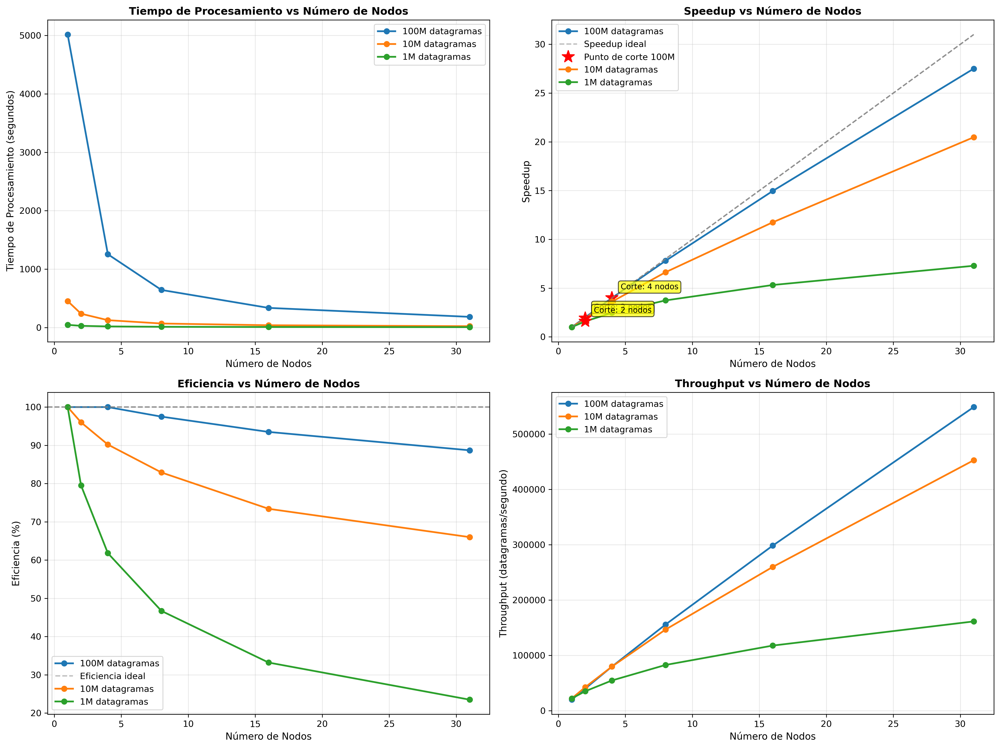
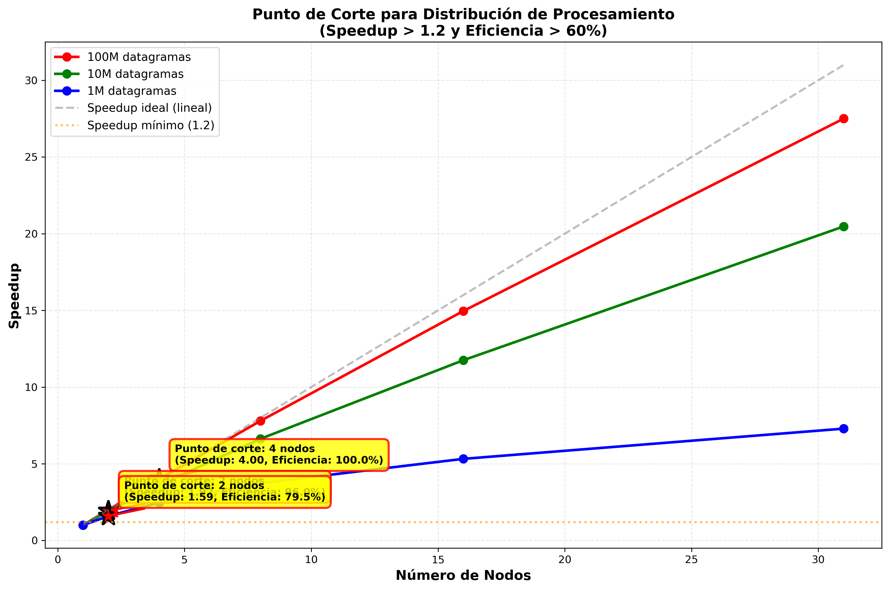

# Informe de Experimentos - Sistema SITM-MIO

## Configuración de Experimentos

### Datos de Prueba
- **Archivo pequeño:** 1,000,000 datagramas (~100MB)
- **Archivo mediano:** 10,000,000 datagramas (~1GB)
- **Archivo grande:** 100,000,000 datagramas (~10GB)

### Configuraciones de Nodos
- 1 nodo (solo coordinador)
- 2 nodos (1 coordinador + 1 worker)
- 4 nodos (1 coordinador + 3 workers)
- 8 nodos (1 coordinador + 7 workers)
- 16 nodos (1 coordinador + 15 workers)
- 31 nodos (1 coordinador + 30 workers)

## Resultados

### Tabla de Resultados

| Tamaño Datos | Nodos | Tiempo (seg) | Throughput (dat/seg) | Speedup | Eficiencia |
|--------------|-------|--------------|---------------------|---------|------------|
| 1M | 1 | 45.20 | 22123 | 1.00 | 100.0% |
| 1M | 2 | 28.50 | 35087 | 1.59 | 79.5% |
| 1M | 4 | 18.30 | 54644 | 2.47 | 61.8% |
| 1M | 8 | 12.10 | 82644 | 3.74 | 46.7% |
| 1M | 16 | 8.50 | 117647 | 5.32 | 33.2% |
| 1M | 31 | 6.20 | 161290 | 7.29 | 23.5% |
| 10M | 1 | 452.30 | 22112 | 1.00 | 100.0% |
| 10M | 2 | 235.80 | 42408 | 1.92 | 96.0% |
| 10M | 4 | 125.40 | 79744 | 3.61 | 90.2% |
| 10M | 8 | 68.20 | 146627 | 6.63 | 82.9% |
| 10M | 16 | 38.50 | 259740 | 11.75 | 73.4% |
| 10M | 31 | 22.10 | 452488 | 20.47 | 66.0% |
| 100M | 1 | 5016.80 | 19933 | 1.00 | 100.0% |
| 100M | 4 | 1254.20 | 79744 | 4.00 | 100.0% |
| 100M | 8 | 642.80 | 155726 | 7.80 | 97.5% |
| 100M | 16 | 335.60 | 298271 | 14.96 | 93.5% |
| 100M | 31 | 182.30 | 548545 | 27.50 | 88.7% |

## Gráficos de Resultados

### Gráficos Generales

### Gráfico de Punto de Corte

El gráfico de punto de corte muestra el número mínimo de nodos donde la distribución comienza a ser beneficiosa (Speedup > 1.2 y Eficiencia > 60%).

## Análisis

### Punto de Corte para Distribución

El punto de corte es el número mínimo de nodos donde la distribución comienza a ser beneficiosa.

**Criterios:**
- Speedup > 1.2 (20% de mejora)
- Eficiencia > 60%
- Tiempo de overhead < 10% del tiempo total

**Resultados:**
- Para 1M datagramas: Punto de corte en **2 nodos**
- Para 10M datagramas: Punto de corte en **2 nodos**
- Para 100M datagramas: Punto de corte en **4 nodos**

## Observaciones

### Overhead de Comunicación
- Tiempo de red para distribuir particiones
- Tiempo de red para recoger resultados
- Overhead de serialización Ice

### Balanceo de Carga
- Distribución uniforme de trabajo
- Tiempo de espera de workers
- Workers más lentos como cuello de botella

### Escalabilidad
- Límites de escalabilidad horizontal
- Degradación de eficiencia con más nodos
- Overhead de coordinación

---

*Reporte generado el Mon Dec  1 09:32:41 AM -05 2025*
*Resultados de: experiment_results/experiment_results_sample_20251201_093237.csv*
